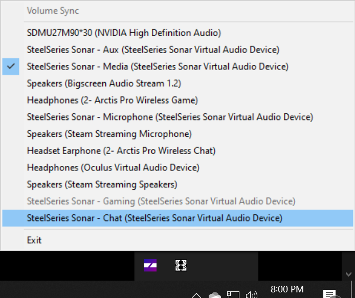

VolumeSync is a simple Windows application to sync volume changes from the default audio output
device to others. This is particularly useful with virtual sound devices, such as those created
by [SteelSeries Sonar](https://steelseries.com/gg/sonar).

## Why VolumeSync?
Applications like [SteelSeries Sonar](https://steelseries.com/gg/sonar) allow for routing different
apps to different virtualized sound devices, allowing customized per application DSP. This works
great until you want to adjust the volume, and you'll be forced to adjust each separately.

## How?
For [SteelSeries Sonar](https://steelseries.com/gg/sonar)
 1. Set your default outoutput device to `SteelSeries Sonar - Gaming (SteelSeries Sonar Virual Audio Device)`. The Sonar app should prompt
you to do this. 
 2. Run the latest installer from the [Volume Sync Releases](https://github.com/cleak/VolumeSync/releases) page.
 3. Right click on new system tray icon and check off any audio devices you want to have your primary
 volume level mirrored to.

That's it! The program will automatically start at boot time.

VolumeSync is event based, meaning it's super light weight - it won't run until Windows notifies it
there's been a change.

